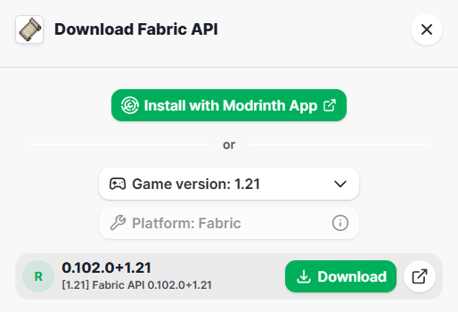
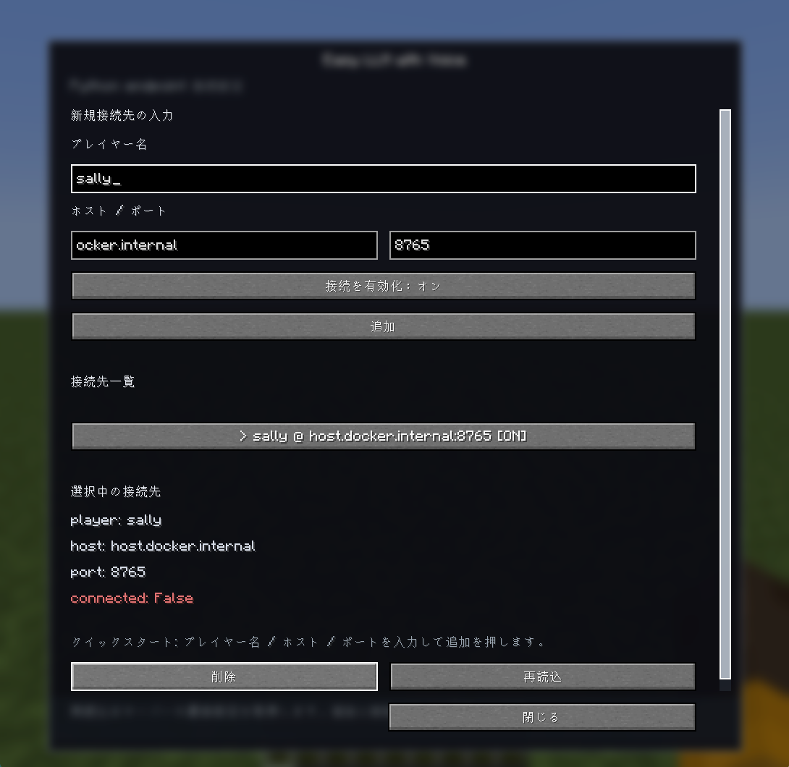

<!-- markdownlint-disable MD033 -->
<p style="font-size:18px">
  | <a href="./README.md">EN</a> | JP |
</p>

# Easy LLM Voice

Easy LLM Voice は、Minecraft 内で一緒に遊べる AI エージェントを開発するためのプラットフォームです。
<br>[Easy LLM Agent in Minecraft](https://github.com/Koichiro-terao/Easy-LLM-Agent-in-Minecraft) を拡張した環境であり、Easy LLM Voice を用いた AI エージェントは、ゲーム内の情報を参照し、LLM を用いて行動や発話を生成し、音声対話を通じて会話できます。

## 最新情報

### 2026-05-22
- エージェントが利用できる関数に関する制限を撤廃しました。
- これにより、エージェントが正常に動作しない可能性を低減しました。

## このリポジトリでできること

Minecraft の世界で、話しながら一緒に遊べる AI エージェントを実装できます。

- ゲーム内の行動・状態・観測情報を WebSocket で外部へ送信する
- LLM を用いて、ゲーム内の情報を考慮しながら行動・発話を行う AI エージェントを実装する
- Minecraft 内の音声を外部 AI エージェントへ渡す
- AI エージェントが生成した音声を Minecraft 内で再生する
- AI エージェントが Simple Voice Chat mod の設定に基づき、プレイヤーと同じ条件で対話できるようにする

## リポジトリ構成

- [minecraft_server_on_docker](./minecraft_server_on_docker/)
  : Docker 上に Minecraft サーバーを構築するためのソースコード
- [mineflayer_server_on_docker](./mineflayer_server_on_docker/)
  : Docker 上に Mineflayer サーバーを構築するためのソースコード
- [src](./src/)
  : AI エージェントを実装するための Python サンプルコード

---

本リポジトリは、[Easy LLM Agent in Minecraft](https://github.com/Koichiro-terao/Easy-LLM-Agent-in-Minecraft) を拡張したものです。まずは Easy LLM Agent in Minecraft をお試しいただき、基本的な使い方や挙動を確認したうえで、Easy LLM Voice Agent in Minecraft をご利用ください。

## Easy LLM Agent in Minecraft: <br>[https://github.com/Koichiro-terao/Easy-LLM-Agent-in-Minecraft](https://github.com/Koichiro-terao/Easy-LLM-Agent-in-Minecraft)

---

# AI エージェント実装までの流れ

Minecraft mod と Python プログラムを用いて、Minecraft 内に AI エージェントを実装する手順を示します。

## 1. 事前準備

以下の手順に従って事前準備を行ってください。動作確認は Windows 11 上で行っています。

### 1.1 Python ライブラリのインストール

Python 3.11 以上の環境を作成し、必要なライブラリをインストールしてください。

[Anaconda](https://www.anaconda.com/download) を用いた Python 環境構築例を示します。
Anaconda を使用する場合、本リポジトリのルートフォルダを開いた PowerShell で以下のコマンドを実行すると、Python 環境が構築されます。

```powershell
conda create -n easy_llm_voice python=3.11
conda activate easy_llm_voice
cd src
python -m pip install --upgrade pip
pip install -r requirements.txt
```

また、本サンプルプログラムでは、RealtimeSTT による GPU 処理を用いたリアルタイム音声認識を使用しています。下記 URL の説明に従い、お使いの PC に適したモジュールをインストールしてください。
[https://github.com/KoljaB/RealtimeSTT](https://github.com/KoljaB/RealtimeSTT)

例: CUDA 12.x 対応の NVIDIA GPU を使用している場合

```powershell
pip install torch==2.5.1+cu121 torchaudio==2.5.1 --index-url https://download.pytorch.org/whl/cu121
```

### 1.2 Docker のインストール

Windows を使用している場合は、[Docker Docs](https://docs.docker.com/desktop/setup/install/windows-install/) からインストーラをダウンロードして実行してください。Docker はバージョン 20.10 以降である必要があります。

### 1.3 Minecraft のインストール

[Minecraft Launcher](https://www.minecraft.net/) をインストールし、Minecraft: Java Edition バージョン 1.21 をプレイできるようにしてください。これはクライアントとして使用します。Java Edition のライセンスが必要です。
<br>Easy LLM Voice で使用する mod は Fabric 環境での使用を前提としています。[Fabric Loader](https://fabricmc.net/) をインストールし、Minecraft バージョン 1.21 の環境を作成してください。その後、Minecraft Launcher で `Fabric` を選択して起動してください。
<br>または、[Prism Launcher](https://prismlauncher.org) などを使用して環境を構築してください。Prism Launcher を使用する場合は、以下の URL を参考にして環境を構築してください。
<br>Fabric with Prism Launcher: [https://wiki.fabricmc.net/player:tutorials:third-party:prism](https://wiki.fabricmc.net/player:tutorials:third-party:prism)

初回起動時は、mod ファイルを入れるフォルダが生成されていないため、クライアントを一度起動してから終了してください。

以下は、Fabric 環境を構築する際に参考となる Web サイトです。

- Fabric Loader: [https://fabricmc.net/](https://fabricmc.net/)
- Installing Fabric: [https://docs.fabricmc.net/players/installing-fabric/](https://docs.fabricmc.net/players/installing-fabric/)
- Fabric with Prism Launcher: [https://wiki.fabricmc.net/player:tutorials:third-party:prism](https://wiki.fabricmc.net/player:tutorials:third-party:prism)

### 1.4 OpenAI API キーの取得

- [こちら](https://platform.openai.com/api-keys)から OpenAI API キーを発行してください。アカウントの作成が必要です。また、[こちら](https://platform.openai.com/settings/organization/billing/overview)から残高が $0.10 以上あることを確認してください。

AI エージェントの行動生成に LLM を使用するため、この API キーを利用します。

### 1.5 mod ファイルのダウンロード

以下の mod ファイルをダウンロードしてください。

- Fabric API: [fabric-api-0.102.0+1.21.jar](https://modrinth.com/mod/fabric-api)
- Simple Voice Chat mod: [`voicechat-fabric-1.21.1-2.6.17.jar`](https://modrinth.com/plugin/simple-voice-chat)
- Easy LLM mod: [easy-llm-fabric-1.0.0+mc1.21.jar][easyllm]
- Easy LLM Voice mod: [easy-llm-voice-fabric-1.0.0+mc1.21.jar][easyllmvoice]

Fabric API は、以下のようにバージョンを選択してダウンロードしてください。

<p align="center">
  
</p>

### 1.6 VOICEVOX サーバーのインストール

本サンプルプログラムでは、VOICEVOX を使用した音声合成を活用しています。

[VOICEVOX ENGINE](https://github.com/VOICEVOX/voicevox_engine/releases) をダウンロードしてください。GPU 版をダウンロードすることで、リアルタイム性を維持しやすくなります。

上記 URL から、お使いの環境に対応した VOICEVOX ENGINE をダウンロードしてください。

例: エンジン本体の Windows GPU/CUDA 版 part1, part2 の 2 つの ZIP ファイルをダウンロードし、7-Zip などを使用して 2 つまとめて解凍します。

VOICEVOX ENGINE は Docker イメージでも配布されていますが、開発環境において通信による遅延が確認されたため、ローカルでの起動を推奨します。

## 2. mod ファイルの配置

### 2.1 Minecraft サーバーへの mod 導入

使用する Minecraft サーバーの `data/mods` フォルダに、ダウンロードした 4 つのファイルを配置してください。

本プロジェクトに含まれる Minecraft サーバーを使用する場合は、[./minecraft_server_on_docker/_mods/1.21](./minecraft_server_on_docker/_mods/1.21) に配置してください。Minecraft サーバー起動時に mod が読み込まれます。
mod ファイル配置後に、[./minecraft_server_on_docker/_mods/1.21/mods_file_here.txt](./minecraft_server_on_docker/_mods/1.21/mods_file_here.txt) を削除してください。

### 2.2 Minecraft クライアントへの mod 導入

使用する Minecraft クライアントの `mods` フォルダに以下のファイルを配置してください。

- Fabric API: [`fabric-api-0.102.0+1.21.jar`](https://modrinth.com/mod/fabric-api)
- Simple Voice Chat: [`voicechat-fabric-1.21.1-2.6.17.jar`](https://modrinth.com/plugin/simple-voice-chat)
- Easy LLM Voice mod: [easy-llm-voice-fabric-1.0.0+mc1.21.jar][easyllmvoice]

## 3. 各サーバーの起動

各サーバーを別々のターミナルで起動します。3 つのターミナルを開いてください。
各ターミナルは、本リポジトリのルートフォルダで開いておいてください。

- Minecraft サーバー（ターミナル A）
- Mineflayer サーバー（ターミナル B）
- VOICEVOX サーバー（ターミナル C）

### 3.1 Minecraft サーバーの起動と準備

- Docker Desktop の起動
  スタートメニューなどから Docker Desktop を起動してください。

- サーバーの起動

  ターミナル A において、以下を実行してください。初回のみ起動に時間がかかります。
  ```
  conda activate easy_llm_voice
  cd minecraft_server_on_docker
  python launch_mc_server_cli.py
  ```

  実行後は、ターミナルに対して、以下のようにワールドの設定を入力すると、Minecraft サーバーが起動します。<br>ポート番号を変更することで、複数の Minecraft サーバーを起動できます。

  ```
  Enter mode name [flat] > flat
  Enter Minecraft port [25565] > 25565
  Enter Minecraft version [1.21] > 1.21
  ```

  以下のようにターミナルに `Done` が出力されると、サーバーの起動が完了しています。

  ```
  [00:39:28] [Server thread/INFO]: Done (0.465s)! For help, type "help"
  ```

- ワールドへの参加

  Minecraft クライアントを起動し、`マルチプレイ` からワールドに参加してください。ワールドが表示されない場合は、`サーバーを追加` で `localhost:25565` のようなサーバーアドレスを指定してください。

- 権限の付与

  ワールドに参加したら、ログが出力されているターミナル A で以下を実行してください。
  ```
  op xxx
  ```
  ここで、`xxx` はあなたの Minecraft ユーザー名です。これにより、あなたのユーザーに op 権限が付与され、さまざまなコマンドを使用可能になります。同一サーバーを再度使用する際には、上記のコマンド実行は不要です。

- simple voice chat mod の確認
  
  simple voice chat mod が利用可能な状態にあるかは以下のファイルの内容を参考に確認をしてください。

  [simplevoicechat 確認方法](./docs/simplevoicechat.jp.md)

**注意**
<br>過去に Docker 上で同じポート番号のサーバーを開いていた場合は、Docker コンテナが停止しているかを確認したうえで、[3.1 Minecraft サーバーの起動と準備](#31-minecraft-サーバーの起動と準備)を行ってください。

### 3.2 Mineflayer サーバーの起動

ターミナル B において、以下を実行してサーバーを起動してください。初回のみ起動に時間がかかります。
```
conda activate easy_llm_voice
cd mineflayer_server_on_docker
python mineflayer_cli.py
```

実行後は、ターミナルに対して、以下のようにワールドの設定を入力すると、Mineflayer サーバーが起動します。

```
Enter Minecraft version [1.21] > 1.21
```

以下のような出力がターミナルに出ると、サーバーの起動が完了しています。

```
Starting container: beliefnestjs
Server started on port 3000
```

### 3.3 VOICEVOX サーバーの起動

ターミナル C において、ルートフォルダで以下を実行してサーバーを起動してください。
ここで、`xxx` はあなたがダウンロードした VOICEVOX ENGINE のフォルダパスです。

```
cd xxx
run.exe --use_gpu
```

以下のような出力がターミナルに出ると、サーバーの起動が完了しています。

```
done!
INFO:     Started server process [7008]
INFO:     Waiting for application startup.
INFO:     Application startup complete.
INFO:     Uvicorn running on http://localhost:50021 (Press CTRL+C to quit)
```

## 4. WebSocket の接続設定

### 4.1 Minecraft 上のセットアップ

- Easy LLM mod との接続設定

  Minecraft 上の観測情報を WebSocket に送信するために、接続先アドレスを設定します。
  Minecraft 上のテキストターミナルで、以下のコマンドを実行してください。
  <br>Minecraft 上のテキストターミナルでコマンドを実行するには、op 権限が必要です。op 権限の設定方法は[こちら](#31-minecraft-サーバーの起動と準備)を参照してください。

  ```
  /obsWs add ws://host.docker.internal:7892
  ```

  現在 Minecraft に設定されている接続先アドレスを確認する場合は、以下のコマンドを実行してください。
  デフォルトでは、Minecraft サーバー起動時に `ws://host.docker.internal:7891` が開くようになっています。

  ```
  /obsWs list
  ```

  現在 Minecraft に設定されている接続先アドレスを削除する場合は、以下のコマンドを実行してください。

  ```
  /obsWs remove ws://host.docker.internal:7892
  ```

- Easy LLM Voice mod との接続設定

  Minecraft 上で Simple Voice Chat mod を介して行われる音声対話に AI エージェントが参加するための WebSocket 接続先アドレスを設定します。
  <br>Minecraft 上の Easy LLM Voice mod GUI から設定を行ってください。

  Easy LLM Voice mod GUI の開き方: `Bキー`を押す

  以下は、[5. サンプルコードの実行](#5-サンプルコードの実行)を行う際に必要となる接続先アドレスを設定する場合の入力例です。
  GUI のテキストボックスに以下のように入力し、`追加` を押してください。

  ```
  プレイヤー名: sally
  ホスト: host.docker.internal
  ポート: 8765
  ```

  `追加` を押した後、以下の図のように `接続先一覧` に `sally @ host.docker.internal:8765 [ON]` が追加されれば完了です。

  

### 4.2 Python 上のセットアップ

`src/sally_cfg.yml` に、取得した OpenAI API キーを入力してください。

その後、`src/sally_cfg.yml` ファイルにおいて、以下の項目が正しく設定されているかを確認してください。

- `src/sally_cfg.yml` の L12 `easy_llm` の項目にある `host` と `port` の 2 つの値が、上記の Easy LLM mod との接続設定で設定した接続先アドレスと一致しているかを確認してください。(Docker 上で Minecraft サーバーを立てている場合は、Minecraft では `ws://host.docker.internal:****`、`src/sally_cfg.yml` では L12 `host: 0.0.0.0`、L13 `port: ****` と設定してください。`****` は任意の 4 桁の数字です。)

- `src/sally_cfg.yml` の L1 `agent` の項目にある `agent_name` の値を、Easy LLM Voice mod GUI の `プレイヤー名` と同じ名前にしてください。
- `src/sally_cfg.yml` の L41 `easy_llm_voice` の項目にある `host` と `port` の 2 つの値が、Easy LLM Voice mod GUI の `ホスト` と `ポート` と一致しているかを確認してください。(Docker 上で Minecraft サーバーを立てている場合は、Minecraft では `host.docker.internal:****`、`src/sally_cfg.yml` では L42 `host: 0.0.0.0`、L43 `port: ****` と設定してください。`****` は任意の 4 桁の数字です。)

- L35 `api_key` に有効な API キーが設定されていることを確認してください。

日本語で会話したい場合は、以下の変更を行ってください。

- L8 `generate_action: ./prompts/coding_llm_human_prompt_template.txt` を `generate_action: ./prompts/coding_llm_human_prompt_template_jp.txt` に変更する
- L9 `primitive: ./prompts/jp/coding_llm_system_prompt_template.txt` を `primitive: ./prompts/jp/coding_llm_system_prompt_template_jp.txt` に変更する

## 5. サンプルコードの実行

サンプルコードを実行するために、ターミナルを 1 つ開いてください。各サーバーの起動に使用したターミナルとは異なるものが必要です。

- main プログラム（ターミナル D）

ターミナル D において、本リポジトリのルートフォルダで以下を実行してプログラムを起動してください。
  ```
  conda activate easy_llm_voice
  cd src
  python main.py --config sally_cfg.yml
  ```

ターミナル D 上に `Action generation will start when you press Enter.` と表示されれば起動完了です。

`sally` が Minecraft ワールドに参加したら、ターミナル A（Minecraft サーバー用）で以下を実行してください。
<br>AI エージェントがチェストなどを使用するために、op 権限を付与する必要があります。

```
op sally
```

以降は任意のタイミングで、ターミナル D に対して Enter キーを一度入力すると、エージェントが行動・発話を生成します。

## 6. 2 人目以降の AI エージェントの追加方法

新たに `agent_cfg.yml` を作成し、main プログラムを実行することで、AI エージェントを追加できます。
<br>サンプルとして、`anne_cfg.yml` を用意しています。

**注意**
<br>AI エージェント 1 体につき、音声認識・音声合成を動作させるために GPU の VRAM が必要です。[開発環境](#開発環境)では、AI エージェント 1 体につき約 4.7 GB の VRAM を使用しています。
<br>VRAM が十分に足りているかを確認したうえで、2 人目以降の AI エージェントを追加してください。

### 6.1 agent_cfg.yml の作成

1. `sally_cfg.yml` のコピーを作成する
  <br>`sally_cfg.yml` のコピーを作成し、任意の名前を付けてください。ここでは `agent_cfg.yml` とします。
2. `agent_cfg.yml` の以下の項目を変更する
  <br>`agent_cfg.yml` をテキストエディタなどで開き、以下の項目を変更します。

- L2 `agent_name`: 任意の名前
- L4 `speaker_id`: 任意の数値
- L14 `port`: 任意の 4 桁の数字
- L35 `api_key`: 有効な API キー
- L43 `port`: 任意の 4 桁の数字
- L52 `port`: 任意の 6 桁の数字

**注意**

- `agent_name` は、ゲーム内のプレイヤーとしてすでに存在していない名前にしてください。Minecraft の仕様上、同じ名前のプレイヤーは同時に存在できません。
- `speaker_id` は、VOICEVOX ENGINE で使用する声を選択するための値です。VOICEVOX ENGINE で使用したい音声に対応した数値を設定してください。他の AI エージェントと区別するために、異なる数字を設定することを推奨します。
- L12 `easy_llm`、L41 `easy_llm_voice`、L50 `tts` におけるポート番号は、他の AI エージェントとは異なる数字を設定してください。

`anne_cfg.yml` を使用する場合は、以下の項目を変更してください。

- L35 `api_key`: 有効な API キー

### 6.2 VOICEVOX サーバーの起動

新たにターミナルを 1 つ開いてください。これまで使用していたターミナルとは異なるものが必要です。
ルートフォルダで以下を実行してサーバーを起動してください。
<br>ここで、`xxx` はあなたがダウンロードした VOICEVOX ENGINE のフォルダパス、`******` は [6.1 agent_cfg.yml の作成](#61-agent_cfgyml-の作成)で設定した L52 `port: "任意の 6 桁の数字"` の値です。

```
cd xxx
run.exe --use_gpu --port ******
```

以下のような出力がターミナルに出ると、サーバーの起動が完了しています。

```
done!
INFO:     Started server process [7008]
INFO:     Waiting for application startup.
INFO:     Application startup complete.
INFO:     Uvicorn running on http://localhost:****** (Press CTRL+C to quit)
```

### 6.3 Minecraft 上のセットアップ

Minecraft 上のテキストターミナルにおいて、以下のコマンドを実行してください。
<br>`****` には、[6.1 agent_cfg.yml の作成](#61-agent_cfgyml-の作成)で設定した L14 `port: "任意の 4 桁の数字"` の値を記述してください。
<br>`anne_cfg.yml` を使用する場合は、`7892` を記述してください。

```
/obsWs add ws://host.docker.internal:****
```

### 6.4 エージェントの追加

新たにターミナルを 1 つ開いてください。これまで使用していたターミナルとは異なるものが必要です。

- main プログラム（ターミナル E）

ターミナル E において、本リポジトリのルートフォルダで以下を実行してプログラムを起動してください。
  ```
  conda activate easy_llm_voice
  cd src
  python main.py --config agent_cfg.yml
  ```

`anne_cfg.yml` を使用する場合は、ターミナル E において、本リポジトリのルートフォルダで以下を実行してください。
  ```
  conda activate easy_llm_voice
  cd src
  python main.py --config anne_cfg.yml
  ```

ターミナル E 上に `Action generation will start when you press Enter.` と表示されれば起動完了です。

AI エージェントが Minecraft ワールドに参加したら、ターミナル A（Minecraft サーバー用）で以下を実行してください。
<br>AI エージェントがチェストなどを使用するために、op 権限を付与する必要があります。

```
op xxx
```

ここで、`xxx` は [6.1 agent_cfg.yml の作成](#61-agent_cfgyml-の作成)で設定した L2 `agent_name: "任意の名前"` の値です。

以降は任意のタイミングで、ターミナル E に対して Enter キーを一度入力すると、エージェントが行動を生成します。

## Credits

- RealtimeSTT by Kolja Beigel
  Github: https://github.com/KoljaB/RealtimeSTT

- Simple Voice Chat by Max Henkel / henkelmax
  <br>Official site: https://modrepo.de/minecraft/voicechat
  <br>Modrinth: https://modrinth.com/plugin/simple-voice-chat

Simple Voice Chat itself is not distributed as part of this project.

## 開発環境

Windows 11
<br>Intel(R) Core(TM) i7-13620H (2.40 GHz)
<br>NVIDIA GeForce RTX 4060

AI エージェント 1 体（RealtimeSTT と VOICEVOX ENGINE を 1 つずつ）を起動した状態で、約 4.7 GB の VRAM を使用します。

## License

本プロジェクトは MIT ライセンスの下で提供されています。詳細については、[LICENSE](./LICENSE) をご参照ください。

コードの一部は、同じく MIT ライセンスの下で提供されている [MineDojo/Voyager](https://github.com/MineDojo/Voyager) を改変して使用しています。

[easyllm]: https://www.curseforge.com/minecraft/mc-mods/easy-llm/files/all?page=1&pageSize=20&showAlphaFiles=hide
[easyllmvoice]: https://www.curseforge.com/minecraft/mc-mods/easy-llm-voice/files/all?page=1&pageSize=20&showAlphaFiles=hide

<!-- markdownlint-enable MD033 -->
