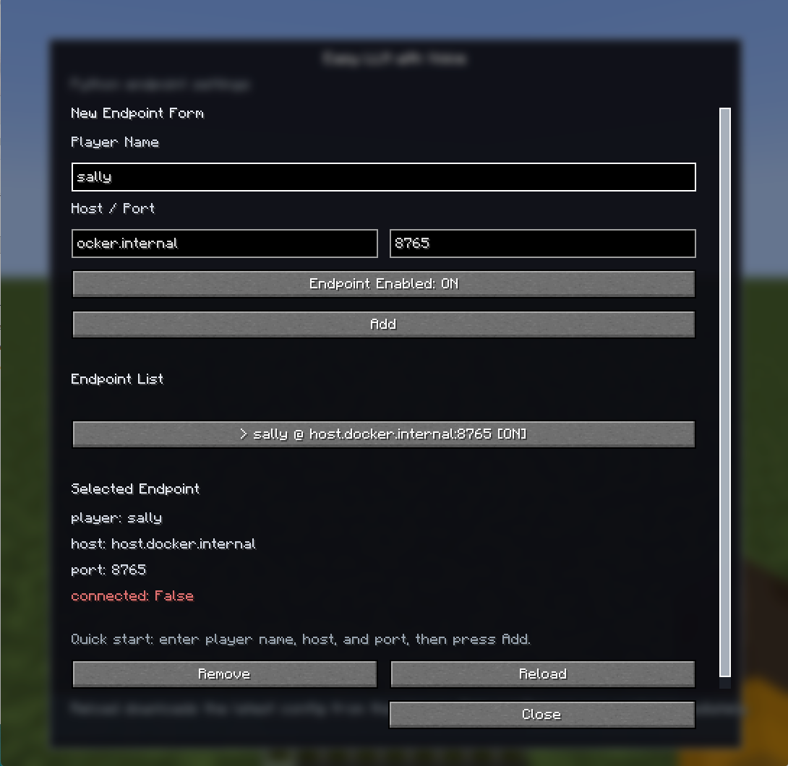

<!-- markdownlint-disable MD033 -->
<p style="font-size:18px">
  | EN | <a href="./README.jp.md">JP</a> |
</p>

# Easy LLM Voice

Easy LLM Voice is a platform for developing AI agents that can play together with you in Minecraft.
<br>It extends [Easy LLM Agent in Minecraft](https://github.com/Koichiro-terao/Easy-LLM-Agent-in-Minecraft), enabling AI agents built with Easy LLM Voice to access in-game information, use an LLM to generate actions and utterances, and interact through voice dialogue.

## Latest Updates

### 2026-07-02
- Created a Docker Image for running the AI agent

### 2026-05-31
- Fixed the physics processing of AI agents and resolved an issue where agents were kicked from the server when taking damage.
- Updated the prompt format to stabilize action generation by the LLM.
- Added support for selecting world data when starting the Minecraft server.

### 2026-05-22
- Removed restrictions on the functions available to the agent.
- Reduced the likelihood of the agent failing to operate.

## What You Can Do with This Repository

Implement an AI agent that can talk and play together with you in a Minecraft world.

- Send in-game actions, states, and observations to external systems via WebSocket
- Implement an AI agent that uses an LLM to act and speak based on in-game information
- Send audio from Minecraft to an external AI agent
- Play audio generated by an AI agent inside Minecraft
- Enable an AI agent to communicate under the same conditions as players, according to the Simple Voice Chat mod settings

## Repository Structure

- [minecraft_server_on_docker](./minecraft_server_on_docker/)
  : Source code for building a Minecraft server on Docker
- [mineflayer_server_on_docker](./mineflayer_server_on_docker/)
  : Source code for building a Mineflayer server on Docker
- [src](./src/)
  : Python sample code for implementing an AI agent
- [bat](./bat/)
  : Bat files for running each Docker container

---

This repository is an extension of [Easy LLM Agent in Minecraft](https://github.com/Koichiro-terao/Easy-LLM-Agent-in-Minecraft). We recommend trying Easy LLM Agent in Minecraft first to understand the basic usage and behavior before using Easy LLM Voice Agent in Minecraft.

## Easy LLM Agent in Minecraft: <br>[https://github.com/Koichiro-terao/Easy-LLM-Agent-in-Minecraft](https://github.com/Koichiro-terao/Easy-LLM-Agent-in-Minecraft)

---

# How to Launch This Repository

This section describes how to implement an AI agent in Minecraft using Minecraft mods and Python programs.

## 1. Prerequisites

Follow the steps below to prepare your environment. Operation has been verified on Windows 11.

### 1.1 Installing Docker

If you are using Windows, download and run the installer from [Docker Docs](https://docs.docker.com/desktop/setup/install/windows-install/). Docker version 20.10 or later is required.

### 1.2 Installing Minecraft

Install [Minecraft Launcher](https://www.minecraft.net/) and make sure you can play Minecraft: Java Edition version 1.21. This will be used as the client. A Java Edition license is required.
<br>The mods used by Easy LLM Voice are intended to run in a Fabric environment. Install [Fabric Loader](https://fabricmc.net/) and create an environment for Minecraft version 1.21. Then select `Fabric` in the Minecraft Launcher and start the game.
<br>Alternatively, you can set up the environment using [Prism Launcher](https://prismlauncher.org) or a similar launcher. If you use Prism Launcher, refer to the URL below when setting up the environment.
<br>Fabric with Prism Launcher: [https://wiki.fabricmc.net/player:tutorials:third-party:prism](https://wiki.fabricmc.net/player:tutorials:third-party:prism)

The folder for mod files is not created until the first launch, so start the client once and then close it.

The following websites may be useful when setting up a Fabric environment.

- Fabric Loader: [https://fabricmc.net/](https://fabricmc.net/)
- Installing Fabric: [https://docs.fabricmc.net/players/installing-fabric/](https://docs.fabricmc.net/players/installing-fabric/)
- Fabric with Prism Launcher: [https://wiki.fabricmc.net/player:tutorials:third-party:prism](https://wiki.fabricmc.net/player:tutorials:third-party:prism)

### 1.3 Obtaining an OpenAI API Key

- Create an OpenAI API key [here](https://platform.openai.com/api-keys). You will need to create an account. Also check [here](https://platform.openai.com/settings/organization/billing/overview) that your balance is at least $0.10.

The API key is used because the AI agent uses an LLM to generate actions.

### 1.4 Downloading Mod Files

Download the following mod files.

- Fabric API: [fabric-api-0.102.0+1.21.jar](https://modrinth.com/mod/fabric-api)
- Simple Voice Chat mod: [`voicechat-fabric-1.21.1-2.6.17.jar`](https://modrinth.com/plugin/simple-voice-chat)
- Easy LLM mod: [easy-llm-fabric-1.0.0+mc1.21.jar][easyllm]
- Easy LLM Voice mod: [easy-llm-voice-fabric-1.0.0+mc1.21.jar][easyllmvoice]

Select the Fabric API version as shown below, then download it.

<p align="center">
  
</p>

## 2. Placing Mod Files

### 2.1 Installing Mods on the Minecraft Server

Place the four downloaded files in the `data/mods` folder of the Minecraft server you will use.

If you use the Minecraft server included in this project, no action is required.

### 2.2 Installing Mods on the Minecraft Client

Place the following files in the `mods` folder of the Minecraft client you will use.
`easy-llm-fabric-1.0.0+mc1.21.jar` runs only on the server side and is not required for the Minecraft client.

- Fabric API: [`fabric-api-0.102.0+1.21.jar`](https://modrinth.com/mod/fabric-api)
- Simple Voice Chat: [`voicechat-fabric-1.21.1-2.6.17.jar`](https://modrinth.com/plugin/simple-voice-chat)
- Easy LLM Voice mod: [easy-llm-voice-fabric-1.0.0+mc1.21.jar][easyllmvoice]

Reference for mod installation: [Fabric Documentation/installing-mods](https://docs.fabricmc.net/players/installing-mods)

## 3. Agent Launch Procedure

This repository runs using the following four Docker containers.
Launch Docker Desktop from the Start menu or a similar location.

- Minecraft server container
- Mineflayer server container
- VOICEVOX server container
- Easy LLM Agent container

### 3.1 Starting the Minecraft Server Container

- Start the server

  Run [bat/start_Minecraft_server.bat](./bat/start_Minecraft_server.bat).
  The first launch may take some time.
  A Minecraft terminal will open.

  The server has finished starting up when `Done` is displayed in the terminal as shown below.

  ```
  [00:39:28] [Server thread/INFO]: Done (0.465s)! For help, type "help"
  ```

- Join the world

  Start the Minecraft client and join the world from `Multiplayer`. If the world is not displayed, use `Add Server` and specify a server address such as `localhost:25565`.

- Grant permissions

  After joining the world, run the following command in the Minecraft server terminal that was launched.
  ```
  op xxx
  ```
  Here, `xxx` is your Minecraft username. This grants operator permissions to your user and allows you to use various commands. You do not need to run this command again when reusing the same server.

- Check Simple Voice Chat mod

  To check whether the Simple Voice Chat mod is available and working correctly, refer to the following file.

  [How to check Simple Voice Chat](./docs/simplevoicechat.en.md)

**Note**
<br>If you previously opened a server on Docker using the same port number, make sure the Docker container has stopped before following [3.1 Starting the Minecraft Server Container](#31-starting-the-minecraft-server-container).


### 3.2 Starting the Mineflayer Server Container

  Run [bat/start_Mineflayer_server.bat](./bat/start_Mineflayer_server.bat). The first launch may take some time.
  A Mineflayer terminal will open.

The server has finished starting up when output like the following appears in the terminal.

```
Starting container: beliefnestjs
Server started on port 3000
```

### 3.3 Starting the VOICEVOX Server Container

Run [bat/start_VOICEVOX.bat](./bat/start_VOICEVOX.bat).
A VOICEVOX terminal will open.

The server has finished starting up when output like the following appears in the terminal.

```
done!
INFO:     Started server process [1]
INFO:     Waiting for application startup.
INFO:     Application startup complete.
INFO:     Uvicorn running on http://0.0.0.0:50021 (Press CTRL+C to quit)
```

### 3.4 Configuring the Config

Enter the OpenAI API key you obtained in the `openai.api_key` or `openairealtime.api_key` field of `src/sally_cfg.yml`.
You can also use the included config_editor to edit the configuration file.

If you want to have conversations in Japanese, make the following changes.

- Change `generate_action: ./prompts/coding_llm_human_prompt_template.txt` to `generate_action: ./prompts/coding_llm_human_prompt_template_jp.txt`
- Change `primitive: ./prompts/coding_llm_system_prompt_template.txt` to `primitive: ./prompts/coding_llm_system_prompt_template_jp.txt`

### 3.5 Minecraft Settings

Easy LLM Voice mod connection settings

  Set the WebSocket destination address that allows the AI agent to join voice dialogue conducted through the Simple Voice Chat mod in Minecraft.
  <br>Configure this from the Easy LLM Voice mod GUI in Minecraft.

  How to open the Easy LLM Voice mod GUI: Press the `B` key

  Enter the following values in the GUI text boxes and press `Add`.

  ```
  Player name: sally
  Host: host.docker.internal
  Port: 8765
  ```

  After pressing `Add`, setup is complete if `sally @ host.docker.internal:8765 [ON]` is added to the `Destination List`, as shown in the figure below.

  

### 3.6 Starting the Easy LLM Agent Container

Run [bat/start_sally.bat](./bat/start_sally.bat).
The first launch may take 10 to 15 minutes due to Docker Image creation.

An Agent-sally terminal will open.

Once `sally` has joined the Minecraft world, run the following command in the Minecraft server terminal.
<br>The AI agent needs operator permissions in order to use chests and other objects.

```
op sally
```

After that, at any time, press the Enter key once in the Agent-sally terminal to make the agent generate actions and utterances.

## Recommended Environment

| Item | Minimum | Recommended |
|---|---|---|
| CPU | 8 cores | 12 cores or more |
| RAM | 16 GB | 32 GB |
| GPU VRAM | 6 GB | 8 GB or more |
| Storage (free space) | 50 GB (SSD) | — |
| OS | Windows 11 | — |
| Docker Desktop | 4.20 or later | — |
| NVIDIA Driver | 525.60.13 or later (CUDA 12.1 supported) | — |
| NVIDIA Container Toolkit | 1.13.0 or later | — |

## Development Environment

Windows 11
<br>Intel(R) Core(TM) i7-13620H (2.40 GHz)
<br>NVIDIA GeForce RTX 4060

When one AI agent is running, with one RealtimeSTT instance and one VOICEVOX ENGINE instance, approximately 4.7 GB of VRAM is used.

## Credits

- RealtimeSTT by Kolja Beigel
  Github: https://github.com/KoljaB/RealtimeSTT

- Simple Voice Chat by Max Henkel / henkelmax
  <br>Official site: https://modrepo.de/minecraft/voicechat
  <br>Modrinth: https://modrinth.com/plugin/simple-voice-chat

Simple Voice Chat itself is not distributed as part of this project.

## License

This project is provided under the MIT License. For details, see [LICENSE](./LICENSE).

Part of the code is based on modified code from [MineDojo/Voyager](https://github.com/MineDojo/Voyager), which is also provided under the MIT License.

[easyllm]: https://www.curseforge.com/minecraft/mc-mods/easy-llm/files/all?page=1&pageSize=20&showAlphaFiles=hide
[easyllmvoice]: https://www.curseforge.com/minecraft/mc-mods/easy-llm-voice/files/all?page=1&pageSize=20&showAlphaFiles=hide

<!-- markdownlint-enable MD033 -->
